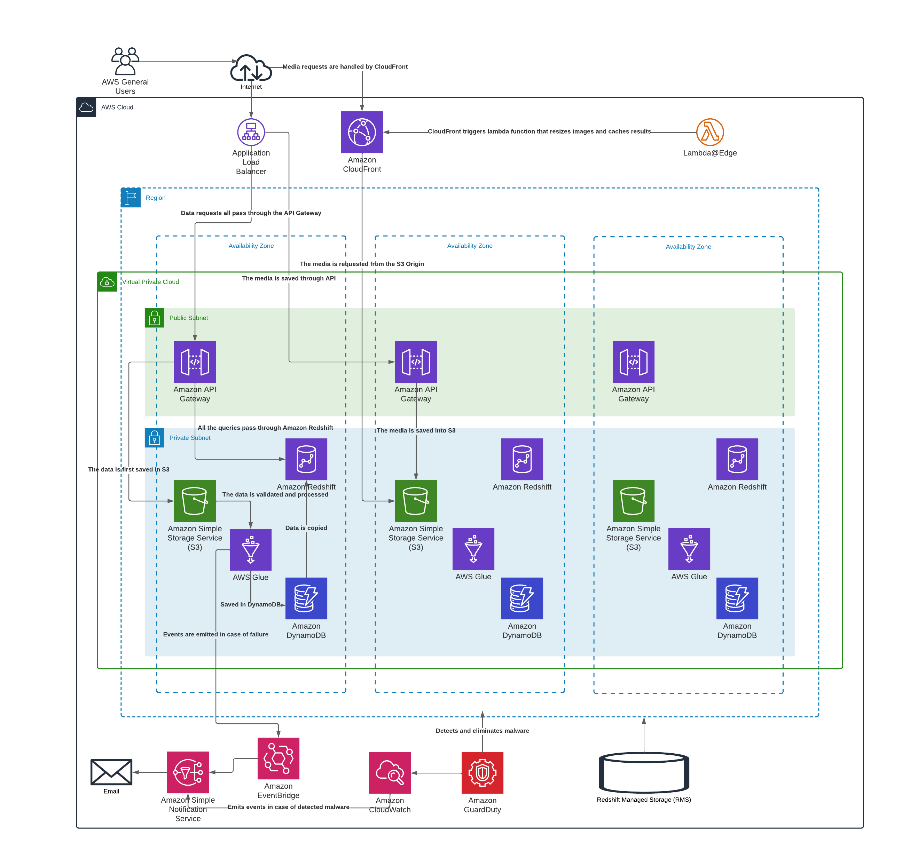

# Architecture challenge

Created with [LucidChart](https://lucid.app/lucidchart/406b1ce1-7e95-4df1-b9ab-c5ad4a8cc6a2/edit?viewport_loc=-49%2C854%2C2852%2C1585%2C0_0&invitationId=inv_daf92fde-ebbe-4999-a1f2-bb9da30d88eb).

* The main goal of this architecture is to create a scalable, 
fault-tolerant data processing pipeline and a highly available data source, hence we have several Availability Zones.

* The overall architecture is serverless to reduce the operational overhead and costs. 
The only exception are the ETLs which are implemented using AWS Glue and Lambda@Edge used to create various media resolutions for different devices.

* Some of the Lambdas or Events that might be necessary depending on our data are left out of the diagram for simplicity.

## Notes

### Data

1. All the data pass through AWS API Gateway and is [saved](https://docs.aws.amazon.com/apigateway/latest/developerguide/integrating-api-with-aws-services-s3.html) into S3 buckets.
2. The saved data is processed by [GuardDuty](https://docs.aws.amazon.com/guardduty/latest/ug/s3-protection.html) to detect malware.
3. In case of malware detections events are [processed](https://docs.aws.amazon.com/guardduty/latest/ug/guardduty_findings_cloudwatch.html) by CloudWatch and sent to SNS.
4. Then it is processed by ETLs defined in AWS Glue and saved into [DynamoDB](https://aws.amazon.com/blogs/database/implement-vertical-partitioning-in-amazon-dynamodb-using-aws-glue/).
5. In case of failures events are [sent](https://repost.aws/knowledge-center/glue-job-fail-retry-lambda-sns-alerts) to SNS through EventBridge.
6. The data is then copied into AWS Redshift to support complex queries.
7. All the query requests are processed by the AWS API Gateway and [forwarded](https://aws.amazon.com/blogs/big-data/build-a-serverless-analytics-application-with-amazon-redshift-and-amazon-api-gateway/) to Redshift.

### Media

1. All the media is also uploaded through the API Gateway and is saved into S3.
2. The requests for the media go through the CloudFront CDN.
3. The media is then processed by [Lambda@Edge](https://aws.amazon.com/blogs/networking-and-content-delivery/resizing-images-with-amazon-cloudfront-lambdaedge-aws-cdn-blog/) to create various media resolutions for different devices.
4. The resolutions are cached inside CloudFront.

### Additions and alternatives

1. We can also use OpenSearch in addition to Redshift to query the textual data.
2. We might setup a [WireGuard Bastion](https://www.procustodibus.com/blog/2021/02/wireguard-with-aws-private-subnets/) to access the data inside the private subnet.
3. Instead of GuardDuty we can use ClamAv to [detect](https://aws.amazon.com/blogs/developer/virus-scan-s3-buckets-with-a-serverless-clamav-based-cdk-construct/) malware.
