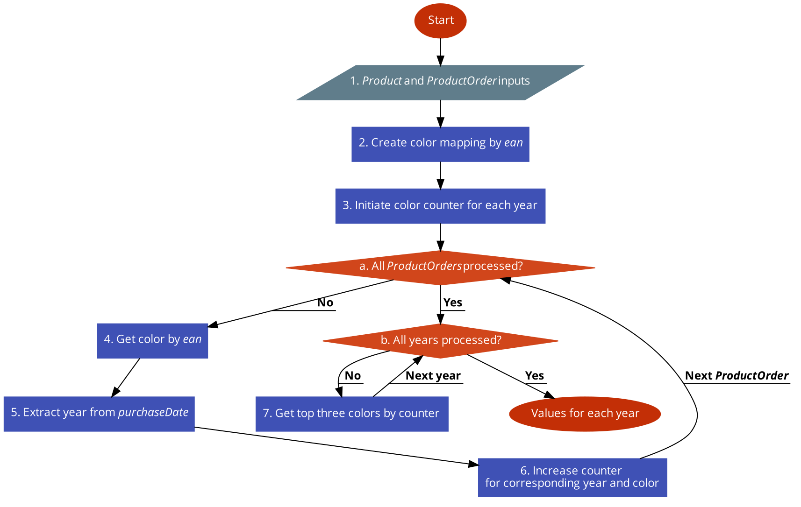

# Thinking challenge

Created using [code2flow](https://app.code2flow.com/XuLHw1).

## Notes

1. The counter from the `node #3` can be implemented as a nested dict.
2. We can get the top three colors from the `node #7` by maintaining an ordered stack.
3. The complexity of the `node #2` is `O(n)` where `n is the number of Products`.
4. The complexity of the `loop #a` is `O(m)` where `m is the number of ProductOrders`.
5. The complexity of the `node #7` is `O(k*p)` where `k is the number of years` and `p is the number of colors`, since the complexity of sorting a fixed sized stack is O(1) (constant).
6. The overall complexity of the algorithm is `O(max(n, m, k*p))`.